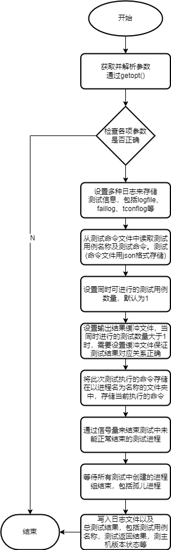

### SYSTEST(system-test)
#### 介绍
SYSTEST是一款用于测试 Linux 内核和相关功能的轻量型测试框架，并针对Linux容器虚拟化相关技术特性提供了额外的测试工具。该项目的目标是向开源社区提供测试，通过将测试自动化引入测试工作来改进 Linux 内核和系统库，以验证 Linux 的可靠性、稳健性和稳定性。


#### 主要模块
1. 测试用例编写模块
2. 测试用例执行模块
3. 基于cmd的ebpf监控工具
4. 容器低级运行时测试方案

#### 项目文件要构成
- src:框架源文件代码
- oci-test:oci容器测试工具及测试代码
- utilitys:其他测试工具
- docs:文档说明和相关资料
- bin:测试框架相关二进制文件
- test:框架模块相关测试
- rungui:测试框架gui
- testcases:测试用例的源码与二进制文件
- systest:cmdline工具

#### 外部参考链接
1.[Linux Test Project](https://github.com/linux-test-project/ltp)  
2.[内核监控libbpf](https://github.com/libbpf/libbpf)  
3.[容器OCI标准低级运行时测试工具](https://github.com/zenlint/ocitools)  
4.[容器镜像测试工具(主要针对docker镜像)](https://github.com/GoogleContainerTools/container-structure-test)  


#### Tutorial

cmdline 测试使用说明:  

```
systest
-C FAILCMDFILE  Command file with all failed test cases.
-T TCONFCMDFILE Command file with all test cases that are not fully tested.
-d TMPDIR       Directory where temporary files will be created.
-t TEST TYPE    Kernel subsystem and container for now
-h              Help. Prints all available options.
-l LOGFILE      Log results of test in a logfile.
-o OUTPUTFILE   Redirect test output to a file.
-I ITERATIONS   Execute the testsuite ITERATIONS times.
-x INSTANCES    Run multiple instances of this testsuite.
-W ZOOFILE      Specify the zoo file used to record current test tags (default PID of this script)

./systest -t container 
测试容器的相关测试用例(目前只有容器相关的测试用例)
```
想自定义组合测试用例，则可在testcases目录下创建文件夹，创建一个runtest.json文件，如testcases/XXXX/runtest.json文件
加入想要测试的用例名和命令，即可用systest commandline工具执行测试

测试编写说明:

使用测试编写框架提供的api  

提供c代码的测试用例编写及shell脚本的用例编写  

提供两个简单的范例  

[example C](https://gitee.com/mengning997/lxc/blob/master/testcases/example/example%20c.c)

[example shell](https://gitee.com/mengning997/lxc/blob/master/testcases/example/example%20shell.sh) 

编写后在testcases目录下对应的子目录testrun.json文件中加入测试用例名称及测试命令，即可通过systest执行测试


#### QuickStart
```
git clone https://gitee.com/mengning997/lxc
make
```

#### Build On Linux
目前采用Makefile，后续可能改用Cmake


#### 框架结构图
  
(TODO)  

#### 执行模块流程图
<div align=center>
   
</div>
 

#### 版本说明
当前版本v1.0(2022.7.5)  
实现了大部分的模块功能，使用makefile对整个项目进行编译，完成后使用systest命令行工具或  
rungui图形化操作测试框架。  
  

当前版本v0.1(2022.6.1)    
实现了简单C代码的测试编写模块，可以在编写c代码测试用例时包含头文件，使用gcc 进行测试用例编译  
案例如下:  
在testcases中创建测试c代码hellotest.c:  
 手动用gcc编译  
`gcc -g  hellotest.c -o hello.o -I../include -L../lib -lmyhello`  
 可以执行hello.o执行单项测试  


#### 版本更新状态
- 2022.6.30 - 7.5
添加了整个项目的makefile文件
现在ltp的测试用例经过小的修改后可以添加进测试框架中
fix一些bug

- 2022.6.28
优化了仓库代码内容设置
添加仓库代码说明
优化测试用例结果详细说明

- 2022.6.27
添加了一个简单的框架gui，可以在gui中选择测试项目以及ebpf工具等
并且可以在gui中将编写的测试用例加入测试命令文件夹中

- 2022.6.25
优化了ebpf工具，现在可以输出监控日志

- 2022.6.21
将测试执行框架读取的测试用例执行命令文件改为json格式，在执行框架中添加json格式文件的解析函数
添加执行函数流程图

- 2022.6.9
修复了shell lib无法正确解析字符的bug

- 2022.6.6
添加了shell代码的测试编写模块，可以在编写shell测试用例时包含shell lib，进行单项测试

- 2022.6.4  
 添加了说明文档并对git仓库重新进行设计

- 2022.6.3 
 添加单项测试结果打印，返回单项测试的多个测试函数结果记录  
 添加简单的Makefile 编译库文件和测试用例  
 TODO:添加测试图形界面，考虑用python或shell  